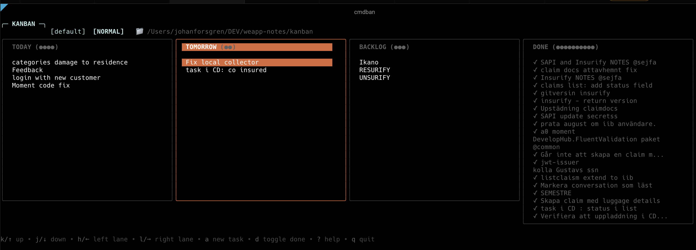

A K9s-inspired terminal Kanban board for developers.

Tasks are plain markdown files. Navigate with vim-ish keybindings. Use it locally, commit tasks to git, or connect directly to Azure DevOps sprint backlogs.

cmdban is built around a few ideas:

- text files over databases
- keyboard-first workflows
- local-first tooling
- composable Unix-style workflows
- fast startup and navigation

The goal is to make task management feel native inside a terminal workflow.



## Why cmdban

Most Kanban tools are either:

- slow web apps
- locked into proprietary formats
- mouse-driven
- difficult to version control
- overbuilt for personal workflows

cmdban keeps everything simple:

- tasks are markdown files
- no database
- git-friendly
- keyboard-first
- fast terminal UI
- optional Azure DevOps sync

---

## Features

- Vim-style navigation (`hjkl`, `gg`, `G`, `ctrl+u`, `ctrl+d`)
- Tasks stored as plain markdown files
- Configurable board columns
- Markdown preview rendering
- Open tasks in `$EDITOR` (`nvim` by default)
- Multiple boards with independent task directories
- Git-friendly workflow
- Azure DevOps sprint backlog sync
- Real-time ADO updates via REST API

---

## Installation

### Build from source

```bash
git clone https://github.com/yourname/cmdban.git
cd cmdban
make build
```

### Install globally

```bash
make install
```

### Go install

```bash
go install github.com/yourname/cmdban@latest
```

---

## Quick Start

Run locally:

```bash
./cmdban
```

Or if installed:

```bash
cmdban
```

Create tasks with `a`.

Move tasks between columns with `H` and `L`.

Open task details with `Enter`.

---

## Task Format

Tasks are regular markdown files.

Example:

```markdown
# Fix websocket reconnect bug

The reconnect handler fails after idle timeout.

## Notes

- reproduce on staging
- inspect retry loop
- verify heartbeat handling

---

@status:today @priority:1 @backend
```

Task metadata is stored in the footer using tags.

`@status:` maps the task to a board column.

Boards can define any column names they want. The default setup uses:

- `today`
- `tomorrow`
- `backlog`
- `done`

---

## Configuration

Configuration is stored in:

```bash
~/.cmdban.yaml
```

Example:

```yaml
current_board: personal

boards:
  - name: personal
    directory: ~/tasks/personal

    columns:
      - name: today
      - name: tomorrow
      - name: backlog
      - name: done

  - name: work
    directory: ~/tasks/work

    columns:
      - name: in-progress
      - name: review
      - name: blocked
      - name: done
```

Each board can define its own columns.

---

## Board Management

Open the board switcher with:

```text
:b
```

or:

```text
ctrl+b
```

From the switcher:

- `j` / `k` navigate boards
- `Enter` switches boards
- `a` creates a new board
- `q` or `Esc` closes the switcher

New boards automatically create their task directory if needed.

---

## Editing Configuration

Open the config file with:

```text
:config
```

After saving and closing, cmdban automatically reloads the configuration.

---

# Azure DevOps Integration

cmdban can connect directly to Azure DevOps sprint backlogs.

Tasks remain visible as Kanban cards inside the terminal while syncing changes back to ADO in real time.

Supported operations:

- fetching sprint work items
- moving work items between states
- creating work items
- editing titles
- refreshing sprint data

Unsupported operations intentionally remain inside the ADO web UI:

- deleting work items
- tag management
- work item reordering

---

## Azure DevOps Setup

### 1. Create a Personal Access Token

Open:

```text
https://dev.azure.com/<your-org>/_usersSettings/tokens
```

Create a new token with:

- Work Items → Read & Write

Copy the generated token.

---

### 2. Store the PAT in cmdban

Start cmdban and run:

```text
:pats
```

Press `a` to create a new entry.

Fields:

- Name → short alias like `myorg`
- Token → PAT value

PATs are stored in:

```bash
~/.cmdban-pats.yaml
```

with `0600` permissions.

PAT manager controls:

- `j` / `k` navigate
- `a` add PAT
- `x` delete PAT
- `space` toggle token visibility
- `q` or `Esc` close

---

### 3. Add an Azure DevOps board

Example:

```yaml
current_board: sprint

boards:
  - name: sprint
    type: azuredevops

    azuredevops:
      org: myorg
      project: Platform
      team: Backend
      iteration: "@CurrentIteration"

      pat: myorg

      default_work_item_type: "User Story"

      column_map:
        today: "Active"
        tomorrow: "Committed"
        backlog: "New"
        done: "Closed"

    columns:
      - name: today
      - name: tomorrow
      - name: backlog
      - name: done
```

`column_map` maps local column names to Azure DevOps work item states.

Example:

- `today` → `Active`
- `done` → `Closed`

Adjust these values to match your ADO workflow.

---

### 4. Switch to the ADO board

Open the board switcher:

```text
:b
```

ADO boards display an `[ADO]` badge.

Switch boards with `Enter`.

cmdban immediately fetches sprint work items and shows sync status in the header.

Press `r` any time to refresh from Azure DevOps.

---

## Multiple Azure DevOps Boards

You can configure multiple ADO boards.

Each board can:

- use different organisations
- use different projects
- use different teams
- use different PATs
- point to different iterations

Example:

```yaml
boards:
  - name: backend-sprint
    type: azuredevops

    azuredevops:
      org: myorg
      project: Platform
      team: Backend
      iteration: "@CurrentIteration"
      pat: myorg

      column_map:
        today: "Active"
        backlog: "New"
        done: "Closed"

    columns:
      - name: today
      - name: backlog
      - name: done

  - name: client-work
    type: azuredevops

    azuredevops:
      org: clientorg
      project: ClientApp
      team: ClientTeam
      iteration: "@CurrentIteration"
      pat: clientorg

      column_map:
        today: "In Progress"
        backlog: "To Do"
        done: "Done"

    columns:
      - name: today
      - name: backlog
      - name: done
```

---

## Azure DevOps Behaviour Differences

Local boards:

- store tasks as markdown files
- allow task deletion
- support tag editing
- support manual task reordering
- open tasks in your editor

ADO boards:

- sync changes through the Azure DevOps API
- block destructive operations
- do not expose local markdown files
- refresh directly from sprint data

---

## Keyboard Shortcuts

### Navigation

- `h` / `l` move between columns
- `j` / `k` move between tasks
- `gg` jump to top
- `G` jump to bottom
- `ctrl+u` scroll up
- `ctrl+d` scroll down

### Task Actions

- `Enter` open task
- `a` create task
- `e` or `i` edit title
- `d` toggle done state
- `t` add tag
- `x` delete task
- `H` / `L` move task between columns

### Commands

- `:` command mode
- `:b` open board switcher
- `:config` open config
- `:pats` open PAT manager
- `r` refresh board
- `q` quit

Full keybindings are documented in:

```text
docs/keybindings.md
```

---

## Environment Variables

`EDITOR`

- editor used for opening tasks
- defaults to `nvim`

Example:

```bash
export EDITOR=vim
```

---

## Development

```bash
make build
make run
make test
make test-coverage
make lint
make clean
make tidy
```
